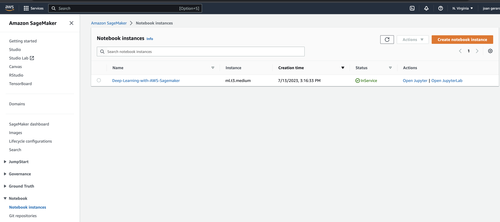

# Operationalizing an AWS ML Project

This project shows how an AWS ML Project can be operationalized using different AWS tools such as EC2, Lambda functions, Jupyter Notebooks, etc.

The project trains a CNN model using the dogs dataset that contains dogs pictures of more than 130 classes. The current project trains a ResNet50 model doing transfer learning to add some more layers, perform hyperparameter tuning, and once the best model is selected, it is deployed to do some inferences. 

The same model training is performed from an EC2 instance. 

Once the model is deployed the endpoint can be invoked via a Lambda Function. 

Finally, concurrency and auto-scaling can be set to scale the invokation, autoscale the endpoints and thus, avoid lattencies when doing inferences. 


## Training and deployment

These files contains the relevant code to perform training and deployment:
- `train_and_deploy.ipynb`: Jupyter notebook that contains the code to perform training, hyperparameter tuning, model selection, deployment and inference checking.
- `hpo.py`: python file that is used for training, evaluating, and saving the model.
- `infernce2.py`: python file that helps processing the image (transform, resize, center, etc.) before passing it to the model for inference. 

A cloud jupyter notebook instance can be created within Sagemaker navigating to `Amazon Sagemaker > Notebook > Notebook Instances` to execute the Jupyter notebook as it is shown in the following image:



A standard instance `ml.t3.medium` was chosen because the instance don't need to perform any computational or memory optimized operation. It is used to create or use other more specialized instance that will be in charge of training or deploying the model. Also, price needs to be considered when choosing an instance to avoid high cost billing at the end of the month and this is the cheapest one. 


The dataset needs to be stored in an S3 bucket so the training instances can access it. The S3 bucket must contain a unique name among all exising S3 bucket in the region. The `dogImagesDS` file contains the ds that will be used for this project.


Once the model is deployed, it will appear under the `Sagemaker > Inference > End Points` section and its status will be `In Service` which means that is ready to receive request and make predictions.


### Multi-instance training

In order to train the model using multiple instances we need to configure the `instance-count` parameter for the estimator: 


## EC2 Training

The file `ec2train1.py` is used in this part to train a model in an EC2 instance.

Before creating the EC2 instance, we need to decide what Amazon Machine Image we need. This will indicate what OS and applications we want to be pre-installed so we can start from there. Since we are running PyTorch we can try to look for an image that already contains a PyTorch environment we can use. 


There are many AMIs that are prepared to be used for Deep Learning using GPUs. These AMIs will be mounted in an computer instance dedicated for deep learning such as G3, P3, G5, etc. The problem is that if you're working with your own account of AWS, you may not have acces to a single instance of these even if you try to request any. Thus, to accomplish the requirements of this project we're going to choose a clean Amazon Linux AMI running on an `ml.m5.xlarge` instance that contains 16GB of memory and 4 vCPUs which should be enough to train our model. It's important to notice that this instance does not contain a GPU so the training happen in CPU only which takes more time to run. We also need to think about costs here as well and this instance is one of the cheapest ones in the market that costs currently $0.23 hourly.


Once the instance is created we need to install python manually together with all the library dependencies we need. In order to run python we can install it as follows in our instance:

```
$ sudo yum install gcc openssl-devel bzip2-devel libffi-devel zlib-devel -y
$ wget https://www.python.org/ftp/python/3.8.9/Python-3.8.9.tgz 
$ tar xzf Python-3.8.9.tgz
$ cd Python-3.8.9
$ sudo ./configure --enable-optimizations
$ sudo make altinstall 
$ cd .. & sudo rm -rf Python-3.8.9 Python-3.8.9.tgz
```

Once it is installed we can install pytorch and the libraries we need:

```
$ alias py="python3.8"
$ alias pip="pip3.8"
$ py -m venv env
$ source env/bin/activate
$ pip install torch torchvision torchaudio --index-url https://download.pytorch.org/whl/cpu
$ pip install tqdm
```

We can download the dataset into the instance and create the directory where the trained model will be saved. 

```
mkdir ml-proj
cd ml-proj
wget https://s3-us-west-1.amazonaws.com/udacity-aind/dog-project/dogImages.zip
unzip dogImages.zip
mkdir TrainedModels
```

Finally, we can upload our code to the EC2 instance using our private key generated by AWS from our local computer as follows:

```
sudo chmod 400 ~/.ssh/ec2-ml-dl.pem
scp -i ~/.ssh/ec2-ml-dl.pem ec2train1.py ec2-user@ec2-34-227-224-149.compute-1.amazonaws.com:ml-proj/solution.py
```

Here it is the output after training the model:


----

### About the ec2train1.py file

This file differs from the jupyter notebook used in Sagemaker in different aspects:
- The file does not use Sagemaker libraries, it uses instead torch standard libraries.
- It does not use the S3 bucket dataset, instead it uses the ds stored in its own volume.
- It does not perform debug and profile so we cannot attach any hook into it. 
- The code in `ec2train1.py` file makes the train in their own instance and it does not use other computer resources to perform that. Whereas the jupyter notebook code can use estimators that can launch many computer resources to perform model training.
- The model artifact is stored locally and not in S3. 

----
## Lambda function setup
A lambda function is created to invoke the created endpoint and obtain a prediction. 


## Security and testing

To avoid the `AccessDenied` error while testing the lambda function, we need to provide the role the right policy to invoke Sagemaker endpoints adding the AmazonSagemakerFullAccess policy as follows:


Then we can add a test event with a json object containing the url of an image such as:

```
{
  "url": "https://s3.amazonaws.com/cdn-origin-etr.akc.org/wp-content/uploads/2017/11/20113314/Carolina-Dog-standing-outdoors.jpg"
}
```
Once we deploy and test the code, you will see something like this:


----
We can see that the body contains an array with the probability that the image belongs to the class of that position of the array. 

### Common Security Vulnerabilities

- AmazonSagemakerFullAccess: In order to avoid giving this Lambda execution role full access to Sagemaker, we can create a custom policy that only provides access to invoking endpoints instead under the Least Priviledge Principle which indicates that the role should have access to only those functions/resources for which they were created and nothing more.
- Roles that are old or inactive: It's important to keep track of the roles constantly and delete those roles that are no longer used or keep inactive. This will avoid that people who does not belong to the organization any more or changed to another department can still have access to execute or use resources that are no longer permitted.
- Roles with policies for functions that the project is no longer using: It's important to also keep track of these functions to avoid being executed accidentaly and revoke those permissions to avoid executing or using resources that are no longer active. 
----

## Concurrency

In case our Lambda function will be executed at the same time for many users we can set concurrency. This is the number of in-flight requests the function is handling at the same time. There are two types of concurrency as cited by AWS documentation:

- Reserved concurrency – Reserved concurrency is the maximum number of concurrent instances you want to allocate to your function. When a function has reserved concurrency, no other function can use that concurrency. There is no charge for configuring reserved concurrency for a function.

- Provisioned concurrency – Provisioned concurrency is the number of pre-initialized execution environments you want to allocate to your function. These execution environments are prepared to respond immediately to incoming function requests. Configuring provisioned concurrency incurs charges to your AWS account.

In other words reserved concurrency are instances that are be available to respond lambda invokations but are not fixed; whereas provisioned concurrency are instances that are fixed and ready to respond lambda invokations. 

In order to activate concurrency we need to deploy the last version of our Lambda Function and create a version.

Then we can reserve a fixed amount of concurrency for our functions such as 5:


2 our of these 5 instances can be provisioned in this case:


 ## Auto-scaling

 Auto scaling is important to avoid latency while invoking the endpoint for prediction. If an endpoint has a heavy load, Sagemaker can easily duplicate the instance to equilibrate the load among the different instances and thus reduce the latency. This can be easily configured from `Sagemaker > Inference > Endpoint > Click on endpoint > Settings > Configure auto scaling`

 

 We can configure a maximum instance count of 3, a scale in cool down and scale out cool down of 30 seconds which means the time that an instance needs to be overload or underload to launch or turn off a new instance. 

 

It's important to mention that the number of maximum instances will have a direct impact to the cost. If we have a heavy load and our API needs to use the 3 instances all the time that will be more expensive that if we set up to scale up to 3 but we only use 1 instance since AWS has a pay for what you use policy. 
